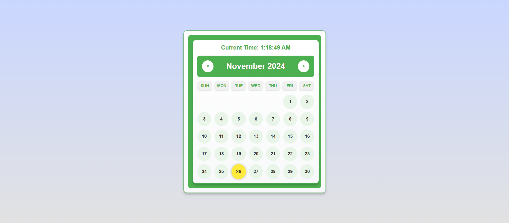

# Smart Calendar: Interactive & Dynamic Date Tracker

Smart Calendar is a visually appealing and interactive date-tracking application. Built with HTML, CSS, and JavaScript, it features a live clock, weekday labels, and custom styling for weekends and the current day. Designed for both functionality and aesthetics, it’s perfect for personal or organizational use.

---

## Features

- **Live Clock**: Displays the current time dynamically at the top of the calendar.
- **Weekday Labels**: Clearly labeled days of the week (Sunday to Saturday).
- **Highlighted Weekends**: Weekends are uniquely styled for easy recognition.
- **Today Highlight**: The current day is emphasized with a glowing effect.
- **Hover Animations**: Smooth scaling and background transitions for calendar days.
- **Fully Responsive**: Adjusts seamlessly to different screen sizes and devices.
- **User-Friendly Design**: Aesthetic layout with rounded corners and soft shadows.
- **Customizable Colors**: Easily update colors to fit your personal or organizational theme.

---

## Technologies Used

- **HTML**: Provides the basic structure of the calendar.
- **CSS**: Adds styles, animations, and a responsive design.
- **JavaScript**: Powers dynamic updates like the live clock and hover effects.

---

## How It Works

1. **Live Clock**: JavaScript fetches the current time and updates it every second.
2. **Interactive Days**: Hovering over any day applies a zoom-in effect with a color change.
3. **Today Highlighting**: The current date is highlighted to make it stand out.

---

## Customization Options

You can customize the following aspects in the code:

- **Colors**: Update the `#4CAF50` and other color codes in the CSS for your theme.
- **Fonts**: Use a different font family by modifying the `font-family` property.
- **Cell Sizes**: Adjust the padding and font sizes in the `#calendar_content div` for larger or smaller calendar cells.

---

## Screenshots

---

## Future Enhancements

- **Event Management**: Add functionality to mark important dates and events.
- **Dark Mode**: Include a toggle for light and dark themes.
- **Localization**: Support for multiple languages and regional date formats.
- **Monthly Navigation**: Enhanced features like jump-to-date or year selection.
- **Mobile Optimizations**: Further refinement for smaller screens.

---

## Acknowledgments

This project was inspired by the need for a simple yet elegant calendar that combines functionality with design.
